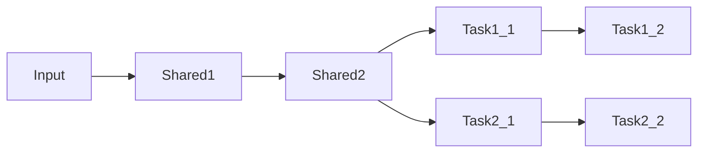
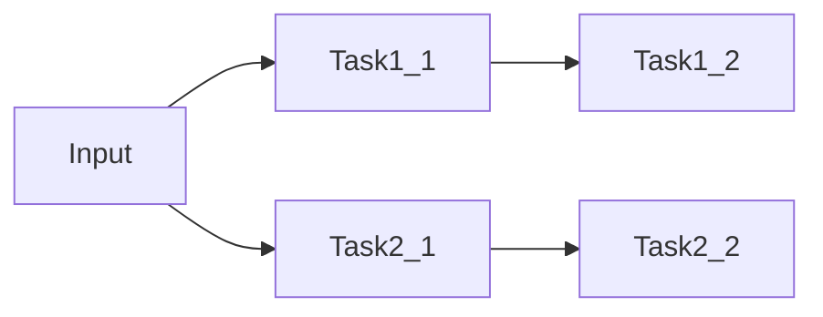

- [Overview](#overview)
  - [Approaches](#approaches)
  - [Loss Functions](#loss-functions)
- [Hybrid](#hybrid)
  - [Shared Backbone](#shared-backbone)
  - [Individual Network for Each Tasks](#individual-network-for-each-tasks)

# Overview

Solve multiple types of tasks using machine learning

## Approaches

1. One neural network for multiple tasks
2. Separate network for each task
3. Hybrid

## Loss Functions

# Hybrid

## Shared Backbone

## Individual Network for Each Tasks

