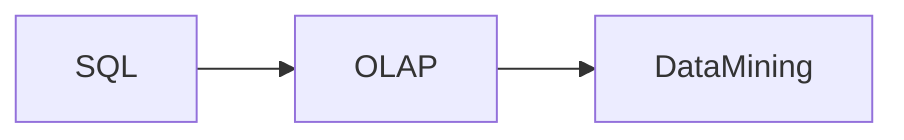

# Overview

Data mining

## Knowledge Discovery in Database

TODO:

Relation ship with data mining

## Spectrum of Query Abstraction

## Data Mining Tasks

TODO:

# Topics

- [Association Rules](AssociationRule.ipynb)
