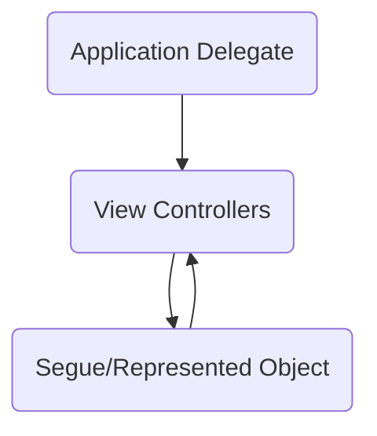

- [Data Flow](#data-flow)
  - [Within View Controller](#within-view-controller)
  - [Between View Controllers](#between-view-controllers)
    - [`NSViewController`](#nsviewcontroller)
- [Container View](#container-view)

# Data Flow

## Within View Controller

Change detection of models can be done using

- **KVO**
- `Combine`

## Between View Controllers



- **Global state** (ex. user token, user name, core data contexts) should be
  created in app delegates, and passed to the root view controller(s); app
  delegate should not be used to store models
- **State** can be passed between view controllers using segues, or using
  `representedObject` in `AppKit`
  - In `AppKit`, where scene transition is less common, `representedObject` is
    used more often

### `NSViewController`

`NSViewController` has `representedObject` property.

- In `didSet`, set up change detection

  ```swift
  var notebook: NoteBookModel?

  override var representedObject: Any? {
    didSet {
      notebook = representedObject as? NoteBookModel

      notebook?.addObserver(
        self, forKeyPath: #keyPath(NoteBookModel.openedEntry), context: nil)
    }
  }
  ```

- This property can be overriden to cascade changes to child view controllers
  ```swift
  override var representedObject: Any? {
    didSet {
      for child in children {
        child.representedObject = representedObject
      }
    }
  }
  ```

# Container View

Both iOS and AppKit provides container view, which allows nested view
controllers
