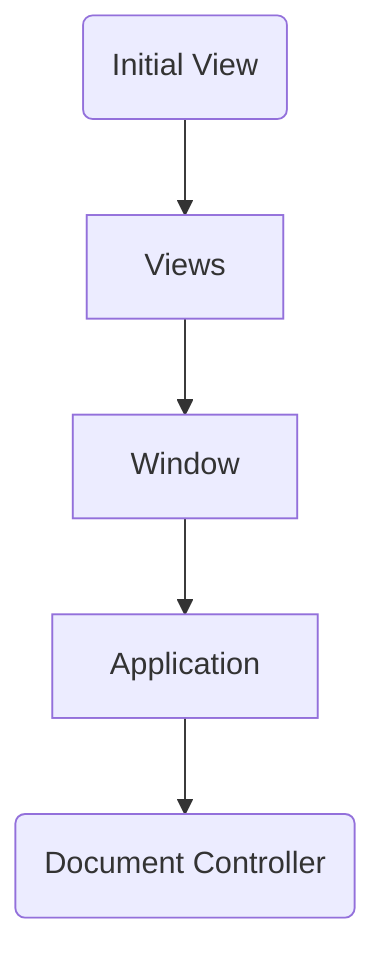

# Responder

A responder is an object in iOS and macOS that can receive events and actions
and handle them.

# Responder Chain

- Document controller is only in chain in document based applications

When an action or event occurs, the event starts from `1` and stops at `4`

- If the object has selectors that can handle the event, the event stops
- Otherwise, the event goes up until finding an object that can handle message
  or events
- If no such objects are found, the event is discarded

# Actions

- In target-action pattern, responders can also accept actions that have no
  targets (actions are sent by controls)
- To properly send an action, use "sentAction:to:from" method of NSApplication
  instance

# Events

- `swipe(with:)` called when a **three-finger** swipe is performed
- `scrollWheel(with:)`: called with a **two-finger** swipe is performed
