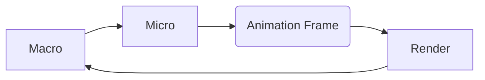

- [Overview](#overview)
- [Macro Tasks](#macro-tasks)
- [Micro Tasks](#micro-tasks)
- [Animation Frame](#animation-frame)
- [References](#references)

# Overview

JavaScript VM maintains a "callback queue". The VM would keep removing the
oldest callback from the queue and execute them.

1. Dequeue and run the oldest task from the macrotask queue (e.g. “script”).
2. Execute all microtasks:
3. Render changes if any.
4. If the macrotask queue is empty, wait till a macrotask appears.
5. Go to step 1.

# Macro Tasks

- `setTimeout`
- `setInterval`
- `setImmediate`
- `<script>`
- `mousemove`

# Micro Tasks

- `Promise`
- `process.nextTick`
- `queueMicroTask`

# Animation Frame

`requestAnimationFrame` execute a callback before render, but after micro tasks.

- `requestAnimationFrame` is one shot; call this function again to execute
  another callback

# References

- [JavaScript.info/Event loop](https://javascript.info/event-loop)
