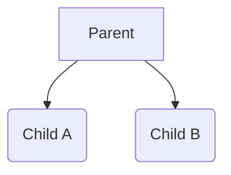

- [Overview](#overview)
  - [Data Safety](#data-safety)
    - [`@Sendable` Closure](#sendable-closure)
    - [Solution](#solution)
  - [Defining and Calling Asynchronous Functions](#defining-and-calling-asynchronous-functions)
  - [Asynchronous Sequences](#asynchronous-sequences)
  - [Tasks](#tasks)
    - [Structured Tasks](#structured-tasks)
    - [Unstructured Tasks](#unstructured-tasks)
  - [Cancellation](#cancellation)
  - [`@main`](#main)
  - [Continuation](#continuation)
- [Naming Convention](#naming-convention)
- [Resources](#resources)

# Overview

## Data Safety

- [Actors](Actors.md): used to isolate data
- [Sendable](Sendable.md): used to mark data as safe to be passed among threads
- Work done by a task is in `@Sendable` closure

### `@Sendable` Closure

- Cannot capture mutable variables
- Values captured must be safe to share
  - Value types
  - Actors
  - Classes that implement their own synchronization

### Solution

1. Child tasks returns individual values, and the parent task processes these
   tasks (Use [`AsyncSequence`](AsyncSequence.md))

## Defining and Calling Asynchronous Functions

```swift
class Container {
  var readOnly: Int {
    get async { return 0 }
    // or
    get async throws { return 0 }
  }
}

func foo(container: Container) async throws -> String {
  return String("data = \(await container.readOnly))"
}
```

- `async`: **enable a function to suspend**
  - Functions marked with `async` does not alawys suspend
  - Used before `throws` **if the method throws**, before `->` **if the method
    does not**
  - Can be used with **read only properties**
- `await`: **marks where an async function may suspend and subsequently resume**

## Asynchronous Sequences

- [AsyncStream](https://developer.apple.com/documentation/swift/asyncstream)

## Tasks

- Tasks are automatically scheduled
- Compiler checks tasks for errors
- A task is not created when `async` function is called

### Structured Tasks



Structured tasks are organized into trees. There are two ways of creating
structured tasks

- [`async-let` tasks](AsyncLet.md)
- [Group tasks](GroupTasks.md)

### Unstructured Tasks

Unstructured tasks do not have a parent task

- [`Task.init`](Task.md) create a task on the current actor
- [`Task.detached`](Task.md) create a task that does does not run on the current
  actor
- **Need for unstructured tasks**:
  - Used to launch async from non-async
  - Some tasks live beyond the confines of a single scope
- Must be manually cancelled or awaited

## Cancellation

```swift
// throws if the current task is canceled
try Task.checkCancellation()

// true if the current task is canceled
Task.isCancelled
```

- Cancellation is cooperative
  - Tasks are not immediately stopped
  - Child task checks cancellation itself and wind down when the child task is
    canceled
  - Async function should be design with cancellation in-mind
- **Consumers of an async function should know if the function return incomplete
  result after being cancelled**

## `@main`

```swift
protocol AsyncApp {
  init()
  func start() async
}

extension AsyncApp {
  static func main() async {
    let app = Self.init()
    await app.start()
  }
}
```

Static `main` functions are allowed to be marked with `async`

## Continuation

- `withXXXContinuation(...) { continuation in }` provides a handle to explicitly
  resume execution of a suspended function
  - Used to bridge with legacy APIs
  - Swift Runtime will report errors if
    - A continuation is neither used to throw errors or to return values
    - A continuation is used to return multiple values

# Naming Convention

Async functions should omit leading words like `get`, which are used to
communicate that the result is not immediately returned, before the introduction
of `async`

# Resources

- [Swift Book: Concurrency](https://docs.swift.org/swift-book/LanguageGuide/Concurrency.html)
- [Actors in Swift: how to use and prevent data races](https://www.avanderlee.com/swift/actors/)
- [Sendable and @Sendable closures explained with code examples](https://www.avanderlee.com/swift/sendable-protocol-closures/)
- [WWDC: Explore structured concurrency in Swift](https://developer.apple.com/videos/play/wwdc2021/10134/)
- [WWDC: Meet async/await in Swift](https://developer.apple.com/videos/play/wwdc2021/10132/)
- [TODO: WWDC: Swift concurrency: Behind the scenes](https://developer.apple.com/videos/play/wwdc2021/10254)
