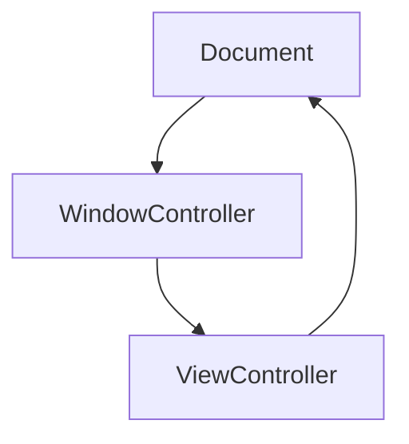

# Overview

```swift
class Document {
  deinit {
    print("Document \(#function)")
  }

  var windowController: WindowController?
}

class WindowController {
  deinit {
    print("WindowController \(#function)")
  }

  var viewController: ViewController?
}

class ViewController {
  deinit {
    print("ViewController \(#function)")
  }

  var document: Document?
}

let document = Document()
let windowController = WindowController()
let viewController = ViewController()

document.windowController = windowController
windowController.viewController = viewController

viewController.document = document
```



When a strong graph reference exists between objects, none of them will be
automatically released, as they all need the other object to be released

# Solution

- Make one of the reference `weak` or `unowned` will remove the cycle
